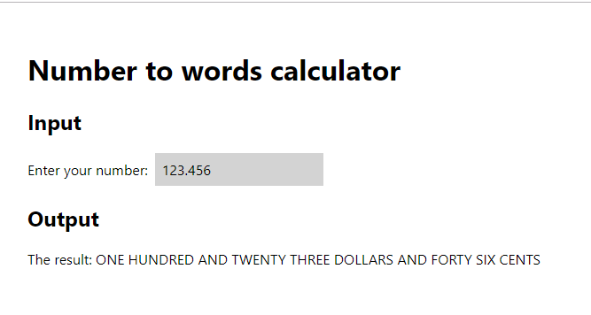

# Hexagon Mining Test

This is my test app for Hexagon Mining.

## Getting started

Written for Nodejs 10.x

    npm i
    npm start

It will launch your browser pointed at the local React app.

## How it's made

Uses create-react-app (v2) plus:

- Redux - state management
- TypeScript - type safety
- Emotion - styling
- Jest/Enzyme - unit and regression testing

All Redux actions and reducers are grouped under `src/ducks` which is an
idea for bundling common reducers and actions together (documented [here](https://github.com/erikras/ducks-modular-redux)).

I chose to store the text input in Redux and format the output in a React component because it is purely formatting. If I wanted to output in more than one place I might store the output in Redux so the algorithm is not done more than once.

## Testing

Run this command to run all unit and regression (snapshot) tests:

    npm test

It is especially important for the input/output algorithm (under `src/components/output-message/formatter.test.ts`).

I have used Jest's coverage reporting to help identify what tests should be written (plus my own judgment). The report is generated when you run the test command (look at `/coverage/index.html`).

## Answers to questions

Answered [here](./ANSWERS.md).